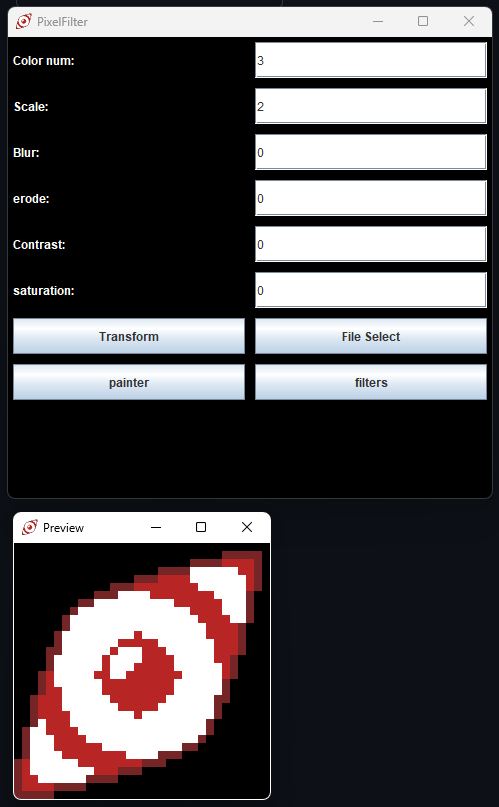
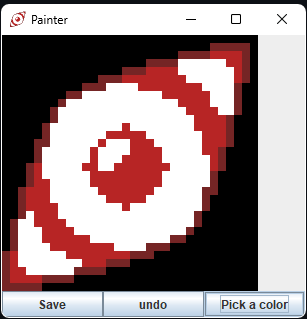
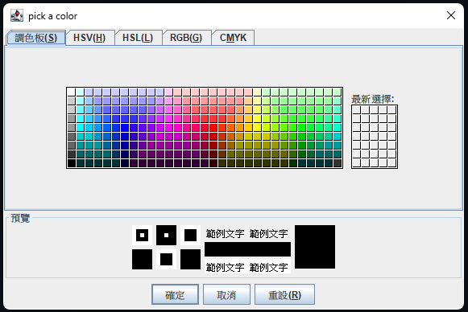
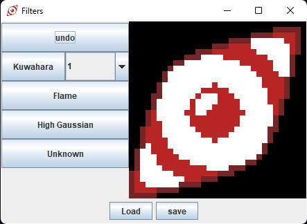

[English](README.md) | 繁體中文
# 像素濾鏡工具 Java 版
透過 Java 製作像素濾鏡工具。

本專案透過 [Python 像素濾鏡工具](https://github.com/JingShing-Tools/Pixel-Art-transform-in-python) 作為參考專案。以此延伸用 Java 編寫此專案。

## GUI
### Main menu

### painter

### palette

### filters


## 環境
### 在 ver 0.3 之前
我沒有使用任何 IDE 和 Java 專案管理工具。底下會說明如何使用 javac 和 cmd 在本地環境運行代碼。

在開始前，建議到 [Opencv Files](https://sourceforge.net/projects/opencvlibrary/files/) 選擇喜歡的版本下載。下載後會得到 ```.exe``` 的壓縮檔。啟動後解壓縮。

解壓縮後會得到一個名稱為 ```opencv``` 的資料夾。開啟以下路徑 ```opencv\opencv\build\java``` 可以得到一個已經編譯好的 ```opencv-版本號.jar``` 的 opencv 庫。將此放入到放置本專案 ```PixelTransform.java``` 的同層資料夾中。除此之外還有兩個 ```x64``` 和 ```x86``` 的資料夾。裡面裝有執行時所需的 ```.dll``` 檔。請依據系統放置其一到放置 ```PixelTransform.java``` 的資料夾中。

將 Opencv 的部分弄完後。

開啟 CMD 並透過 CD 指令讀取到放置 ```PixelTransform.java``` 的資料夾。輸入 ```javac -d . -classpath .;opencv-版本號.jar PixelTransform.java``` 即可編譯好 ```.class``` 檔。

執行則需輸入 ```java -classpath .;opencv-版本號.jar pixel.filter.PixelTransform```

---
### 在版本 0.3 之後
我開始使用 eclipse 作為我的 IDE 和 maven 作為我的專案管理工具。

這是我第一次使用它們，所以我在作業的途中有作筆記。

可以在 ```note/note.md``` 查看。裡頭記載了這個專案我所遇到的問題。

## 版本
### Ver 0.1
* 成功透過 Python 代碼重構成 Java 的 Opencv 調用。
* 功能實現:
  * 顆粒大小  
  * 顏色數量
### Ver 0.2
* 功能:
  * 自定義輸入
  * 輪廓線(腐蝕函數)
  * 模糊(雙向濾波)
### Ver 0.3
* 功能:
  * 對比度
  * 飽和度
### Ver 0.4
* 功能:
  * 圖形化介面
  * 專案化管理
  * 預覽窗口
  * 首個打包釋出的版本
### Ver 0.5
* 功能:
  * 新增畫筆繪圖窗口
    * 可以在圖片上繪圖
    * 可以選擇畫筆顏色
    * 可以保存繪圖圖片
  * 新增更多濾鏡窗口
    * 新增更多濾鏡的窗口
### Ver 0.5.1
* 修復:
  * UI 文字
  * UI 排版
  * 如果濾鏡還在運算，則按鈕會無法使用
  * 修復 "undo" 回到上一步的 bug。如果沒有做更改時，按 undo 造成的無法運算濾鏡錯誤
仍在開發...
